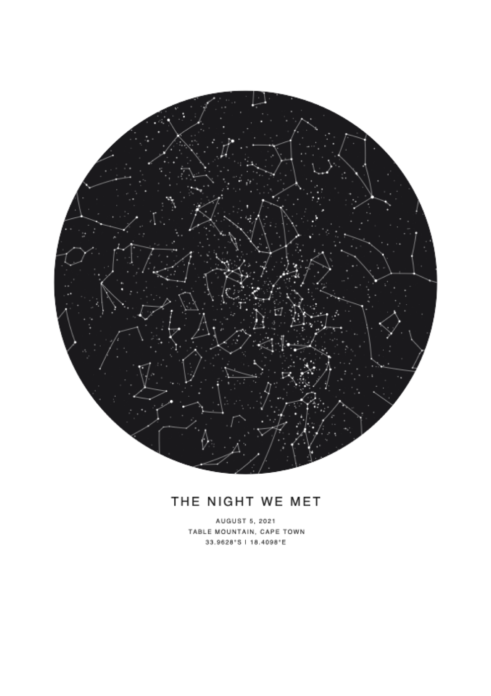

<p align="center"></p>

# Overhead



**Overhead** turns any moment into a print-ready poster of the sky above it: the night you met, a wedding, a birth. It also makes black-and-white stargazing charts (a planisphere and a sky-overhead chart) to use outside. Design it, then download a **vector PDF**. It's free and open source, and everything runs in your browser: no backend, no accounts, nothing uploaded.

**Live site:** https://enzoperesafonso.github.io/overhead/

I built it because these posters are essentially a bit of astronomy and a nice layout, and I didn't think they should cost money. If you make something you love, that's the whole point.

Made by [Enzo Afonso](https://github.com/enzoperesafonso).

## Features
- Real sky for any date, time, time zone and location (precession, planets, Sun, Moon with phase, Milky Way).
- Limiting magnitude (up to 8), star size/contrast, realistic star colours, glow or spikes, atmospheric dimming.
- Constellation lines, names (Latin or abbreviation), IAU boundaries, Messier objects, named stars.
- Alt-az and RA/Dec grids, ecliptic, celestial equator, degree/compass borders, 4 projections, field of view, rotation, mirror.
- 11 themes plus full colour control; shapes: circle, square, rounded, arch, hexagon, heart, full page.
- 18 paper sizes + custom, bleed, page frame, typography (sans/serif/mono or your own .ttf).
- **Stargazing charts**, always black and white for easy printing: a **planisphere** (rotating star wheel plus a horizon-window cover, reusable all year) or a **sky overhead** chart for one date, time and place (compass ring, altitude circles, visible planets and the Moon). Both include a how-to, location and time details, an optional logo and an optional credit line.
- **Naked-eye only** button: stars to magnitude 6, bright deep-sky objects, the five visible planets.
- Export PDF (vector), SVG, PNG (up to 600 dpi); share a link or save/open a design file. Zoom and pan the live preview.

## Run
```bash
npm start            # http://localhost:8080  (or: node server.mjs 3000)
```
The app is plain static files (ES modules, no build step), so any static host works.

## Deploy
- **Netlify / Cloudflare Pages / Vercel**: point at this folder, no build command, publish directory `.`
- **GitHub Pages**: push to `main`; `.github/workflows/pages.yml` deploys it.
- **Docker**: `docker build -t overhead . && docker run -p 8080:80 overhead`
- Or copy `index.html css js data vendor` to any web server.

## Notes
- Place search uses the Open-Meteo geocoding API (only the search text is sent). Offline, type coordinates instead.
- Pick the time zone for the *place* (search sets it) so daylight saving is right.
- Stars beyond magnitude 6 (1 MB) load on demand.
- `npm test` checks the planisphere geometry and renders sample posters and planispheres headlessly to PDF/SVG in `tools/out`.
- Regenerate data: `npm i && npm run build:data`.

## Credits
Star, constellation, Milky Way and DSO data from [d3-celestial](https://github.com/ofrohn/d3-celestial) (BSD-3, Olaf Frohn; Hipparcos-derived). PDF via [jsPDF](https://github.com/parallax/jsPDF) (MIT). Planet positions use Paul Schlyter's low-precision method.

## License
Free to use, copy and modify for non-commercial purposes under the [PolyForm Noncommercial License 1.0.0](LICENSE). Personal use and gifts are fine; selling it or using it commercially needs the author's permission. Bundled data and libraries keep their own licences (see `vendor/`).
